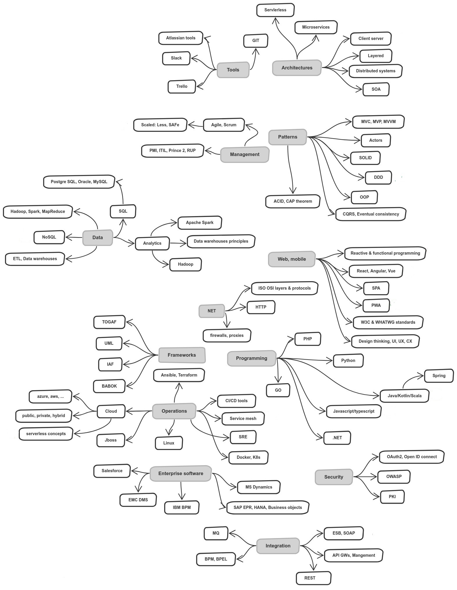
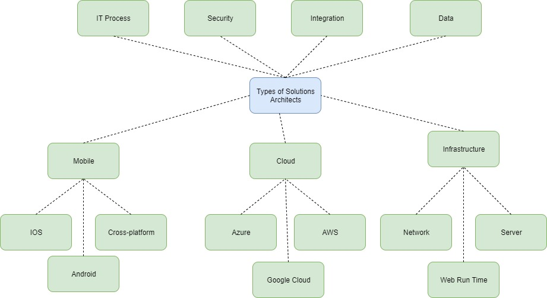

## Contents
- [What is a Software Architect?](#what-is-a-software-architect)
- [Levels of Architecture](#levels-of-architecture)
- [Typical Activities](#typical-activities)
- [Important Skills](#important-skills)
  - [(1) Design](#1-design)
  - [(2) Decide](#2-decide)
  - [(3) Simplify](#3-simplify)
  - [(4) Code](#4-code)
  - [(5) Document](#5-document)
  - [(6) Communicate](#6-communicate)
  - [(7) Estimate and Evaluate](#7-estimate-and-evaluate)
  - [(8) Balance](#8-balance)
  - [(9) Consult and Coach](#9-consult-and-coach)
  - [(10) Market](#10-market)
- [Architect's Technology Roadmap](#architects-technology-roadmap)
- [Types of Solution Architects](#types-of-solution-architects)
- [Suggested Books](#suggested-books)

# What is a Software Architect?
* A software architect is a software expert who makes high-level design choices and dictates technical standards, including software coding standards, tools, and platforms.
_(Source: Wikipedia: Software Architect)_
* Software architecture is the fundamental organization of a system, represented by its components, their relationships to each other and to the environment, and the principles that determine the design and evolution of the system.
_(Source: Handbook of Software Architecture)_

# Levels of Architecture
Architecture can be done on several “levels” of abstractness. The level influences the importance of necessary skills. As there are many possible categorizations possible my favorite segmentation includes these 3 levels:
* **Application Level**: The lowest level of architecture. Focus on one single application. Very detailed, low level design. Communication usually within one development team.
* **Solution Level**: The mid-level of architecture. Focus on one or more applications which fulfill a business need (business solution). Some high, but mainly low-level design. Communication between multiple development teams.
* **Enterprise Level**: The highest level of architecture. Focus on multiple solutions. High level, abstract design, which needs to be detailed out by solution or application architects. Communication across the organization. See [Link](https://github.com/justinamiller/EnterpriseArchitecture) to learn more.

Sometimes architects are also seen as “glue” between different stakeholders. Three examples:

* **Horizontal**: Bridge communication between business and developers or different development teams.
* **Vertical**: Bridge communication between developers and managers.
* **Technology**: Integrate different technologies or applications with each other

# Typical Activities
To understand the necessary skills an architect needs, we first need to understand typical activities. The following list contains from my perspective the most important activities:

* Define and decide development technology and platform
* Define development standards, e.g., coding standards, tools, review processes, test approach, etc.
* Support identifying and understanding business requirements
* Design systems and take decisions based on requirements
* Document and communicate architectural definitions, design and decisions
* Check and review architecture and code, e.g., check if defined patterns and coding standards are implemented properly
* Collaborate with other architects and stakeholders
* Coach and consult developers
* Detail out and refine higher level design into lower level design

   _Note: Architecture is a continuous activity, especially when it is applied in agile software development. Therefore,     these activities are done over and over again._

# Important Skills
To support the laid-out activities specific skills are required. From my experience, read books and discussions we can boil this down to these ten skills every software architect should have:
  * Design
  * Decide
  * Simplify
  * Code
  * Document
  * Communicate
  * Estimate
  * Balance
  * Consult
  * Market

## (1) Design
What makes a good design? This is probably the most important and challenging question. I will make a distinction between theory and practice. To my experience, having a mix of both is most valuable. Let’s start with theory:

* **Know the basic design patterns**: Patterns are one of the most important tools an architect needs to have to develop maintainable systems. With patterns you can reuse designs to solve common problems with proven solutions. The book “Design Patterns: Elements of Reusable Object-Oriented Software” written by John Vlissides, Ralph Johnson, Richard Helm, Erich Gamma is a must-read to everyone who is in software development. Although the patterns were published more than 20 years ago they are still the basis of modern software architecture. For example, the Model-View-Controller (MVC) pattern was described in this book, which is applied in many areas or is the basis for newer pattern, e.g. Model-View-ViewModel (MVVM).
* **Dig deeper into patterns and anti-patterns**: If you already know all basic Gang-of-Four patterns, then extend your knowledge with more software design patterns or dig deeper into your area of interest. One of my favorite books about application integration is “Enterprise Integration Patterns” written by Gregor Hohpe. This book is applicable in various areas whenever two applications need to exchange data, whether it is an old-school file exchange from some legacy systems or a modern microservice architecture.
* **Know quality measures**: Defining architecture is not the end. There are reasons why guidelines and coding standards are defined, applied and controlled. You do this because of quality and non-functional requirements. You want to have a system which is maintainable, reliable, adaptable, secure, testable, scalable, usable, etc. And one piece to achieving all of these quality attributes is applying good architecture work. You can start to learn more about quality measures on Wikipedia.
Theory is important. Practice is equally—or even more—important if you do not want to become an Ivory Tower Architect.
* **Try out and understand different technology stacks**: I think this is the most important activity if you want to become a better architect. Try out (new) technology stacks and learn their ups and downs. Different or new technology comes with different design aspects and patterns. You most likely do not learn anything from just flipping through abstract slides but by trying it out by yourself and feeling the pain or the relief. An architect should not only have broad, but—also in some areas—deep knowledge. It is not important to master all technology stacks but to have a solid understanding of the most important in your area. Also, try out technology which is not in your area, e.g., if you are deep into SAP R/3 you should also try JavaScript and vice versa. Still, both parties will be surprised about the latest advances in SAP S/4 Hana. For example, you can try it by yourself and take a course at openSAP for free. Be curious and try out new things. Also try out stuff which you did not like some years ago.
* **Analyze and understand applied patterns**: Have a look at any current framework, e.g., Angular. You can study a lot of patterns in practice, e.g., Observables. Try to understand how it is applied in the framework, why it was done. And if you are really dedicated, have a deeper look into the code and understand how it was implemented.
* **Be curious and attend User Groups**. [Meetup](https://www.meetup.com/)

## (2) Decide
An architect needs to be able to take decisions and guide projects or the entire organization into the right direction.

* **Know what is important**: Do not waste time with unimportant decisions or activities. Learn what is important. To my knowledge there is not a book which has these information. My personal favorites are these 2 characteristics which I usually consider when evaluating if something is important or not:
  1. Conceptional Integrity: If you decide to do it in one way, stick to it, even if it is sometimes better to do it differently. Usually, this leads to a more straightforward overall concept, eases comprehensibility and eases maintenance.
  2. Uniformity: If you for example define and apply naming conventions it is not about upper- or lowercase, but to have it applied everywhere in the same way.
* **Prioritize**: Some decisions are highly critical. If they are not taken early enough workarounds are build up which are often unlikely to be removed later and are a nightmare for maintenance, or worse, developers simply stop working until a decision is taken. In such situations it is sometimes even better to go with a “bad” decision instead of having no decision. But before it comes to this situation, consider prioritizing upcoming decisions. There are different ways to do so. I suggest having a look at the Weighted Shortest Job First (WSJF) model which is widely used within agile software development. Especially the measures time criticality and risk reduction are critical to estimate the priority of architecture decisions.
* **Know your competence**: Do not decide things which are not in your competence. This is critical as it may ruin your position as architect significantly if not considered. To avoid this, clarify with your peers which responsibilities you have and what is part of your role. If there are more than one architect, then you should respect the level of architecture in which you are currently deployed. As an lower level architect you better come up with suggestions for higher level architecture instead of decisions. Further, I recommend checking critical decisions always with a peer.
* **Evaluate multiple options**: Always lay out more than one option if it comes to decisions. In the majority of the cases I was involved in, there was more than one possible (good) option. Going with only one option is bad in two respects: First, it seems that you did not do your job properly and secondly it impedes making proper decisions. By defining measures, options can be compared based on facts instead of gut feelings, e.g. license costs or maturity. This usually leads to better and more sustainable decisions. Further, it eases to sell the decision to different stakeholders. Besides, if you do not have evaluated options properly you may miss arguments when it comes to discussions.

## (3) Simplify
Keep in mind the problem-solving principle Occam’s Razor which states to prefer simplicity. I interpret the principle as following: If you have too many assumptions about the problem to solve your solution will probably be wrong or lead to an unnecessary complex solution. Assumptions should be reduced (simplified) to come to a good solution.

* **Shake the solution**: To get solutions simplified, it often helps to “shake” the solution and look at them from different positions. Try to shape the solution by thinking top-down and again bottom-up. If you have a data flow or process, then first think left to right and again right to left. Ask questions such as: “What happens to your solution in a perfect world?” Or: “What would company / person X do?” (Where X is probably not your competitor, but one of the GAFA (Google, Apple, Facebook, & Amazon) companies.) Both questions force you to reduce assumptions as suggested by Occam’s Razor.
* **Take a step back**: After intense and long discussions, highly complex scribbles are often the results. You should never ever see these as the final results. Take a step back: Have a look at the big picture again (abstract level). Does it still make sense? Then go through it on the abstract level again and refactor. Sometimes it helps to stop a discussion and continue the next day. At least my brain needs some time to process and to come up with better, more elegant and simpler solutions.
* **Divide and Conquer**: Simplify the problem by dividing it into smaller pieces. Then solve them independently. Afterwards validate if the small pieces match together. Take the step back to have a look at the overall picture for this.
* **Refactoring is not evil**: It is totally ok to start with a more complex solution if no better idea can be found. If the solution is making troubles you can later rethink the solution and apply your learning. Refactoring is not evil. But before you start refactoring, keep in mind to have (1) enough automated tests in place which can ensure the proper functionality of the system and (2) the buy-in from your stakeholders. To learn more about refactoring I suggest reading “Refactoring. Improving the Design of Existing Code” by Martin Fowler.

## (4) Code
Even as an Enterprise Architect, the most abstract level of architecture, you should still know what developers are doing on their daily basis. And if you do not understand how this is done, you may face two major problems:
  1. Developers won’t accept your sayings.
  2. You do not understand challenges and needs of developers.

* **Have a side project**: The purpose of this is to try out new technologies and tools to find out how development is done today and in the future. Experience is the combination of observations, emotions and hypothesis (“Experience and Knowledge Management in Software Engineering” by Kurt Schneider). Reading a tutorial or some pros and cons is good. But this is just “book knowledge”. Only if you try out things by yourself you can experience emotions and can built up hypothesis about why something is good or bad. And the longer you work with a technology the better your hypothesis will get. This will help you to take better decisions in your day to day work. As I started programming I had no code completion and only some utility libraries to speed up development. Obviously, with this background I would make wrong decisions today. Today, we have tons of programming languages, frameworks, tools, processes and practices. Only if you have some experience and a rough overview in the major trends you are able to take part of the conversation and to steer development into the right direction.
* **Find the right things to try out**: You cannot try out everything. This is simply impossible. You need a more structured approach. One source I recently discovered is the [Technology Radar](https://www.thoughtworks.com/radar) from ThoughtWorks. They categorize technologies, tools, platforms, languages and frameworks into four categories:
  * Adopt: “strong feeling to be ready for enterprise usage”.
  * Trial: “enterprise should try it in one project that can handle the risk”.
  * Assess: “explore how it affects your enterprise”
  * Hold: “process with caution”.

With this categorization it is easier to get an overview of new things and their readiness to better evaluate which trend to explore next.

## (5) Document
Architectural documentation is sometimes more and sometimes less important. Important documents are for example architectural decisions or code guidelines. Initial documentation is often required before coding starts and need to be refined continuously. Other documentation can be automatically generated as code can also be documentation, e.g. UML class diagrams.

* **Clean Code**: Code is the best documentation if done right. A good architect should be capable to distinguish between good and bad code. A really great resource to learn more about good and bad code is the book “Clean Code” by Robert C. Martin.
* **Generate documentation where possible**: Systems are changing quickly and it is hard to update the documentation. Whether it is about APIs or system landscapes in form of CMDBs (Configuration management database): The underlying information often changes too fast to keep the corresponding documentation up to date by hand. Example: For APIs you could auto generate documentation based on the definition file if you are model driven, or directly from the source code. A lot of tools exist for that, I think Swagger and RAML are a good starting point to learn more.
* **As much as necessary, as little as possible**: Whatever you need to document, e.g., decision papers, try to focus on only one thing at a time and include only the necessary information for this one thing. Extensive documentation is hard to read and to understand. Additional information should be stored in the appendix. Especially for decision papers it is more important to tell a convincing story instead of just throwing tons of arguments. Further, this saves you and your co-workers, who have to read it, a lot of time. Have a look at some documentation you have done in the past (source code, models, decision papers, etc.) and ask yourself the following questions: “Are all necessary information included to understand it?”, “Which information are really required and which could be omitted?” and “Does the documentation has a red line?”.
* **Learn more about architecture frameworks**: This point could be applied to all other “technical” points as well. I put it here, as frameworks like TOGAF or Zachmann are providing “tools” which feel heavy on the documentation site, although their added value is not limited to documentation. Getting certified in such a framework teaches you to tackle architecture more systematically.

## (6) Communicate
From my observations this is one of the most underestimated skill. If you are brilliant in design but cannot communicate your ideas, your thoughts are likely to have less impact or even fail to succeed.

* **Learn how to communicate your ideas**: When collaborating on a board or flip chart, it is essential to know how to use it properly in order to structure you and your peers’ thoughts. I found the book “UZMO — Thinking With Your Pen” to be a good resource to enhance my skills in this area. As an architect you usually do not only participating in a meeting, usually you need to drive the meeting and to moderate it.
* **Give talks to large groups**: Presenting your ideas to a small or large group should be doable for you. If you feel uncomfortable with this, start presenting to your best friend. Enlarge the group slowly. This is something which you can only learn by doing and by leaving your personal comfort zone. Be patient with yourself, this process may take some time.
* **Find the right level of communication**: Different stakeholders have different interests and views. They need to be addressed individually on their level. Before you communicate, step back and check if the information you want to share have the right level, regarding abstractness, content, goals, motivations, etc. Example: A developer is usually interested in the very little detail of the solution, whereas a manager prefers to know which option saves most money.
* **Communicate often**: A brilliant architecture is worthless if nobody knows about it. Distribute the target architecture and the thoughts behind it, regularly and on every organizational level. Schedule meetings with developers, architects and managers to show them the desired or defined way.
* **Be transparent**: Regular communication mitigates missing transparency only partially. You need to make the reason behind decisions transparent. Especially, if people are not involved in the decision-making process it is hard to understand and to follow the decision and rationale behind it.
* **Be always prepared to give a presentation**: There is always someone with questions and you want to give the right answers immediately. Try to always have the most important slides in a consolidated set which you can show and explain. It saves you a lot of time and it gives security to yourself.

## (7) Estimate and Evaluate
* **Know basic project management principles**: As architect or lead developer you are often asked for estimates to realize your ideas: How long, how much, how many people, which skills, etc.? Of course, if you plan to introduce new tools or frameworks you need to have an answer for these kind of “management” questions. Initially, you should be able to give a rough estimate, like days, months or years. And do not forget that it is not only about implementing, there are more activities to consider, like requirements engineering, testing and fixing bugs. Therefore, you should know the activities the used software development process. One thing you can apply to get better estimates, is to use past data and derive your prediction from that. If you do not have past data, you can also try approaches such as COCOMO by Barry W. Boehm. If you are deployed in an agile project, learn how to estimate and to plan properly: The book “Agile Estimating and Planning” by Mike Cohn provides a solid overview in this area.
* **Evaluate “unknown” architecture**: As architect you should also be able to evaluate the suitability of architectures for the current or future context(s). This is not an easy task but you can prepare for it by having a set of questions at hand which are common for every architecture. And it’s not only about architecture but also about how the system is managed, as this also gives you insides about the quality. I suggest to always have some questions prepared and ready to use. Some ideas for general questions:
  1. Design practices: Which patterns does the architecture follow? Are they consequently and correctly used? Does the design follow a red line or is there an uncontrolled growth? Is there a clear structure and separation of concerns?
  2. Development practices: Code guidelines in place and followed? How is the code versioned? Deployment practices?
  3. Quality assurance: Test automation coverage? Static code analysis in place and good results? Peer reviews in place?
  4. Security: Which security concepts are in place? Built-in security? Penetration tests or automated security analysis tools in place and regularly used?

## (8) Balance
* **Quality comes at a price**: Earlier I talked about quality and non-functional requirements. If you overdo architecture it will increase costs and probably lower speed of development. You need to balance architectural and functional requirements. Over engineering should be avoided.
* **Solve contradicting goals**: A classic example of contradicting goals are short- and long-term goals. Projects often tend to build the simplest solution whereas an architect has the long-term vision in mind. Often, the simple solution does not fit into the long-term solution and is at risk to be thrown away later (sunk costs). To avoid implementation into the wrong direction, two things need to be considered:
  1. Developers and business need to understand the long term vision and their benefits in order to adapt their solution and
  2. managers who are responsible for budget need to be involved to understand the financial impact. It is not necessary to have 100% of the long term vision in place directly, but the developed piece should fit into it.
* **Conflict management**: Architects are often the glue between multiple groups with different backgrounds. This may lead to conflicts on different levels of communication. To find a balanced solution which also reflect long-term, strategic goals, it is often the role of architects to help overcome the conflict. My starting point regarding communication theory was the “Four-Ears Model” of Schulze von Thun. Based on this model a lot can be shown and deducted. But this theory needs some practice, which should be experienced during communication seminars.

## (9) Consult and Coach
Being pro-active is probably the best you can do when it comes to consulting and coaching. If you are asked, it is often too late. And cleaning up on the architecture site is something which you want to avoid. You need to somehow foresee the next weeks, months or even years and prepare yourself and the organization for the next steps.

* **Have a vision**: If you are deployed in a project, whether it is a traditional waterfall like approach or agile, you always need to have a vision of your mid- and long-term goals you want to achieve. This is not a detailed concept, but more a road-map towards everyone can work. As you cannot achieve everything at once (it is a journey) I prefer to use maturity models. They give a clear structure which can be easily consumed and give the current status of progress at every time. For different aspects I use different models, e.g. development practices or continuous delivery. Every level in the maturity model has clear requirements which follow the SMART criteria in order to ease measuring if you have achieved it or not. One nice example I found is for continues delivery.
* **Build a community of practice (CoP)**: Exchanging experience and knowledge among a common interest group helps distributing ideas and standardizing approaches. For example you could gather all JavaScript developer and architects in one room, every three months or so, and discuss past and current challenges and how they were tackled or new methodologies and approaches. Architects can share, discuss and align their visions, developers can share experience and learn from their peers. Such a round can be highly beneficial for the enterprise but also for the individual itself, as it helps building a stronger network and distributes ideas. Also check out the article Communities of Practice from the SAFe Framework which explains the CoP concept in an agile setting.
* **Conduct open door sessions**: One source of misconceptions or ambiguity is lack of communication. Block a fixed time slot, e.g. 30 min every week, for exchanging hot topics with your peers. This session has no agenda everything can be discussed. Try to solve minor things on the spot. Schedule follow-ups on the more complex topics.

## (10) Market
Your ideas are great and you have communicated them well but still nobody wants to follow? Then you probably lack marketing skills.

* **Motivate and convince**: How do companies convince you of buying a product? They demonstrate its value and benefits. But not just with 5 bullet points. They wrap it nicely and make it as easy as possible to digest.
  1. Prototypes: Show a prototype of your idea. There are plenty of tools for creating prototypes. In the context of enterprises who love SAP check out build.me in which you can create nice looking and clickable UI5 apps fast and easy.
  2. Show a video: Instead of “boring slides” you can also show a video which demonstrates your idea or at least the direction.
But please, don’t overdo marketing: In the long term, content is king. If your words do not come true, this will damage your reputation in the long term.
* **Fight for your ideas and be persistent**: People sometime do not like your ideas or they are just too lazy to follow them. If you are really convinced by your ideas, you should continuously go after them and “fight”. This is sometimes necessary. Architecture decisions with long term goals are often not the easiest one’s: Developers do not like them, as they are more complex to develop. Managers do not like them, as they are more expensive in the short term. This is your job to be persistent and to negotiate.
* **Find allies**: Establishing or enforcing your ideas on your own can be hard or even impossible. Try to find allies who can support and help convincing others. Use your network. If you do not have one yet, start building it now. You could start by talking to your (open-minded) peers about your ideas. If they like it, or at least parts of it, it is likely that they support your idea if asked by others (“The idea by X was interesting.”). If they don’t like it, ask for the why: Maybe you have missed something? Or your story is not convincing enough? Next step is to find allies with decision power. Ask for an open-minded discussion. If you fear the discussion, remember that sometimes you need to leave your comfort zone.
* **Repeat It, Believe It**: “[…] studies show that repeated exposure to an opinion makes people believe the opinion is more prevalent, even if the source of that opinion is only a single person.” (Source: The Financial Brand) If you publish few messages often enough, it can help to convince people more easily. But be aware: From my perspective such a strategy should be used wisely as it could backfire as a lousy marketing trick.

# Architect's Technology Roadmap

# Types of Solution Architects

# Suggested Books
 * **Refactoring. Improving the Design of Existing Code** by Martin Fowler
 * **Enterprise Integration Patterns** written by Gregor Hohpe
 * **Design Patterns: Elements of Reusable Object-Oriented Software** by John Vlissides, Ralph Johnson, Richard Helm, Erich Gamma
 * **Experience and Knowledge Management in Software Engineering** by Kurt Schneider
 * **Clean Code** by Robert C. Martin
 * **UZMO — Thinking With Your Pen**
 * **Agile Estimating and Planning** by Mike Cohn
